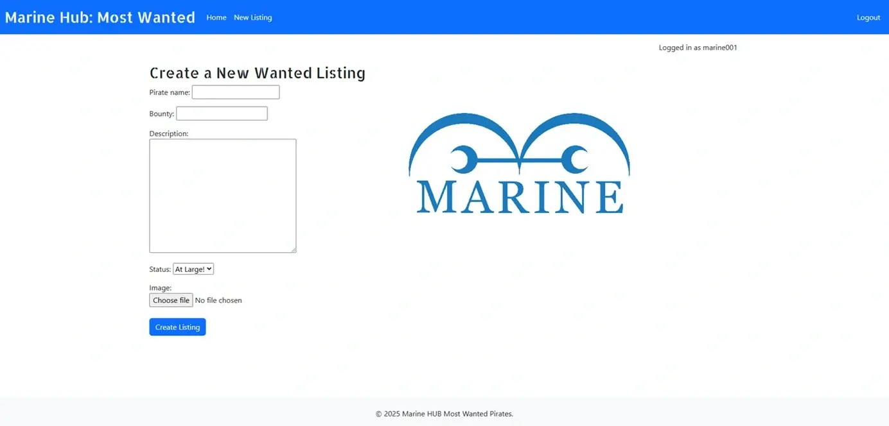
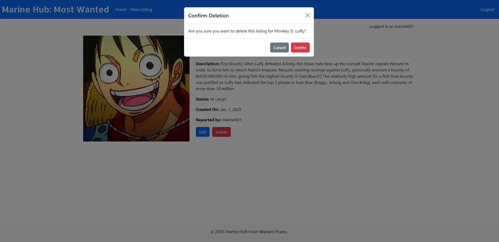
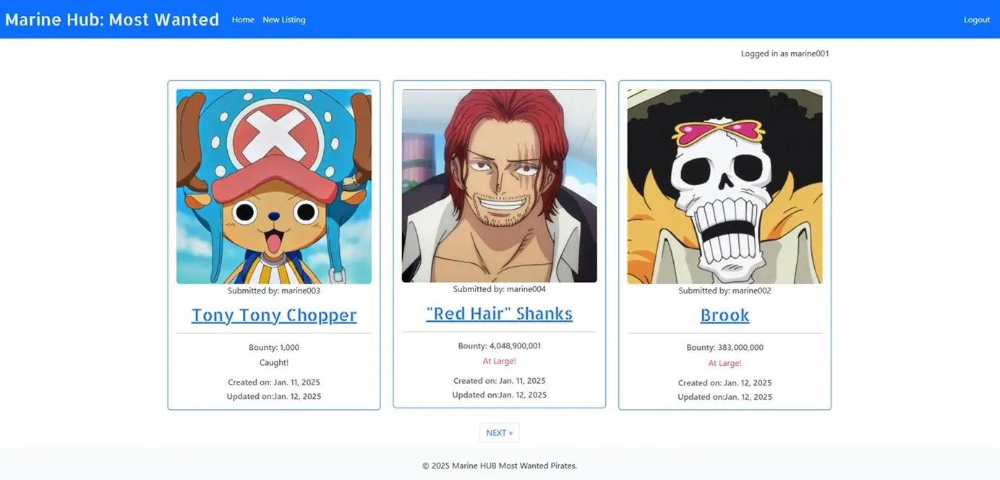
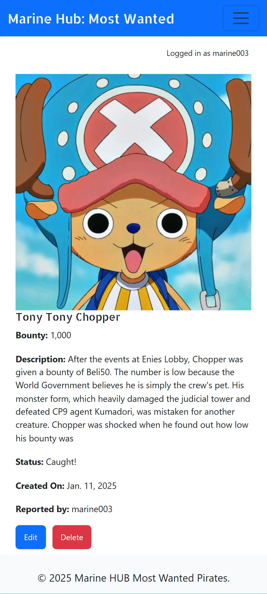
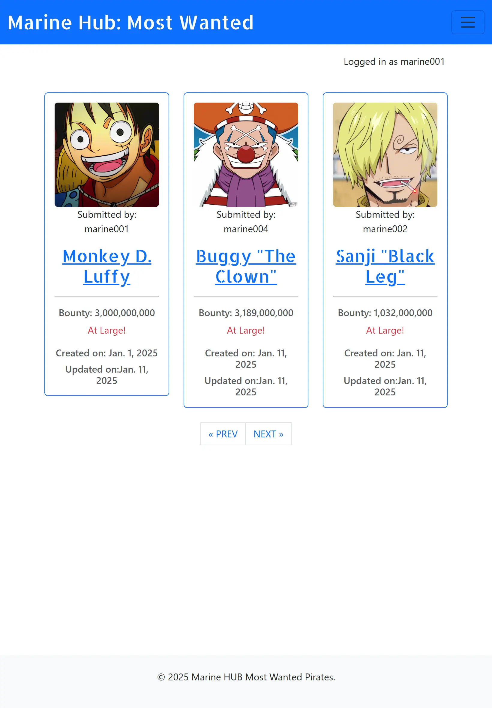

# Marine Hub: Most Wanted Pirates

A web application inspired by One Piece, designed for the Marines to efficiently log, view, edit, and delete the most wanted pirates lists. The hub allows Marine officers to manage and maintain a real-time database of bounties, track wanted pirates, and update their status with ease, ensuring that the latest criminal activity is always up to date.

[Link to site](https://marine-hub-c8dbfbfaea4e.herokuapp.com/) 
_To open links in a new tab, hold CTRL + Click_

## Table of Contents
- [Features](#features)
- [Installation](#installation)
- [Database](#database)
- [Testing](#testing)
- [Deployment](#deployment)
- [Technologies Used](#technologies-used)
- [Acknowledgments](#acknowledgments)

## Features

- Add new pirate records.

- Edit existing pirate records.

- Delete existing pirate records.

- View most wanted pirates with bounty details.

- User authentication to edit the site.
- Responsive design for easy use on desktop and mobile devices 

## Future enhancements
* A future enhancement to the site is to allow visitors to a listing to comment to engange the users more.
* An additional enhancement to the site would be search functionality to allow for a precise experience when using the site.

 

# Installation

### 1. Clone the repository
Clone the GitHub repository to your local machine : [Link to repository](https://github.com/MCamish29/op_marine_hub.git)

### 2. Install dependencies
pip install -r requirements.txt

### 3. Apply migrations
python manage.py migrate

### 4. Run server
python manage.py runserver

### Prerequisites

Make sure you have the following installed:

- Django (Django~=4.2.1)
- Any other dependencies (e.g., PostgreSQL, Redis, etc.)
- gunicorn (gunicorn~=20.1)
- PostgreSQL (dj-database-url~=0.5 psycopg2~=2.9)
- Cloudinary (cloudinary~=1.36.0 dj3-cloudinary-storage~=0.0.6 urllib3~=1.26.15)
- Summernote (django-summernote~=0.8.20.0)
- whitenoise (whitenoise~=5.3.0)

You can install them via `pip3` 
Packages must be added to requirements.txt `pip3 freeze --local > requirements.txt`

# Database

## Entity-Relationship Diagram (ERD)

### User Table
| **Key**          | **Name**        | **Type**           |
|-------------------|-----------------|--------------------|
| Primary Key       | `id`            | Integer            |
| Attribute         | `username`      | String             |
| Attribute         | `email`         | String             |
| Attribute         | `password`      | String             |
| Attribute         | (other default fields) | Various   |

### Wanted Table
| **Key**          | **Name**        | **Type**           |
|-------------------|-----------------|--------------------|
| Primary Key       | `id`            | Integer            |
| Attribute         | `pirate_name`   | String             |
| Attribute         | `slug`          | String             |
| Attribute         | `bounty`        | Big Integer        |
| Attribute         | `pirate_image`  | String (Cloudinary)| 
| Attribute         | `description`   | Text               |
| Attribute         | `created_on`    | Date               |
| Attribute         | `updated_on`    | Date               |
| Attribute         | `status`        | Integer (Choices)  |
| Foreign Key       | `author_id`     | Integer (References `User.id`) |

## Relationships
- **User → Wanted**: One-to-Many relationship
  - A single `User` can create multiple `Wanted` records.
  - `author_id` in the `Wanted` table is a foreign key referencing `User.id`.

 

# Testing

| **Test** | **Steps** | **Expected Result** | **Result** |
| --- | --- | --- | --- |
| Home page displays from URL | 1. Type the URL into the browser   2. Press Enter | The home page loads with its contents, including the navbar and footer. | Pass |
| Additional listings displayed | 1. Click the next or previous pagination buttons | Additional listings are displayed in the same format as the current page. | Pass |
| Login to existing account | 1. Click Login on the Navbar   2. Enter username and password   3. Click Sign In | After signing in, the user is redirected to the home page, with a confirmation message appearing in the top right. The navbar will also display the Logout option. | Pass |
| Login to existing account - incorrect password/username | 1. Click Login on the Navbar   2. Enter username and/or incorrect password   3. Click Sign In | The user remains on the login page and sees an error message indicating that the login credentials are incorrect. | Pass |
| Logging out of account | 1. Click Log Out on the navbar   2. Click Sign Out | After signing out, the user is redirected to the home page, with a confirmation message appearing in the top right. The site will show that the user is logged out, and the navbar will display the Log In and Register options. | Pass |
| Registering a new account | 1. Click Register on the navbar   2. Enter required fields   3. Click Sign Up | After completing the registration and clicking Sign Up, the user account is created, and a confirmation message appears in the top right. The navbar will show the Logout option. | Pass |
| Registering a new account - without entering username | 1. Click Register on the navbar   2. Enter required fields excluding username   3. Click Sign Up | The system will prompt the user to provide a username, displaying a message indicating the missing field. | Pass |
| Registering a new account - with incorrect password requirements | 1. Click Register on the navbar   2. Enter required fields but not meeting the password requirements   3. Click Sign Up | A message will appear indicating that the password does not meet the required criteria. | Pass |
| Viewing pirate details as a visitor of listing | 1. Click on pirate name | The user is redirected to the pirate details page, where all the pirate's information and image are displayed. | Pass |
| Viewing pirate details as creator of listing | 1. Click on pirate name | The user is redirected to the pirate details page, where all information and the pirate's image are displayed, along with buttons for editing and deleting the listing. | Pass |
| Returning to home page | 1. Click on Home | The user is redirected to the home page, no matter which page they are currently viewing. | Pass |
| Returning to home page | 1. Click on brand name "Marine Hub: Most Wanted" | The user is redirected to the home page from any other page. | Pass |
| Edit current listing as creator of listing | 1. Click on pirate name   2. Click on Edit   3. Edit relevant fields   4. Click Save Changes | The user selects their pirate listing to access the edit option. After editing, clicking Save Changes will update the listing, and the changes will be reflected on both the home page and the pirate details page. | Pass |
| Cancel edit of current listing as creator of listing | 1. Click on pirate name   2. Click on Edit   3. Click Cancel | The user can cancel the edit, and they will be redirected back to the pirate details page without saving changes. | Pass |
| Delete listing as creator of listing | 1. Click on pirate name   2. Click on Delete   3. Click Delete | After confirming deletion, the listing is removed from the home page, and a success message is displayed. | Pass |
| Cancel delete of current listing as creator of listing | 1. Click on pirate name   2. Click on Delete   3. Click Cancel | The user cancels the delete action, and the pirate details page is displayed without making any changes. | Pass |
| Create a new listing | 1. Click New Listing on navbar   2. Fill in required fields   3. Click Create Listing | After filling out the necessary information and clicking Create Listing, the user is redirected to the home page, where the new listing appears. | Pass |
| Create a new listing - not meeting required fields | 1. Click New Listing on navbar   2. Fill in some of the required fields   3. Click Create Listing | A message will appear indicating which required fields are missing, and the user will not be able to submit the form until all fields are filled in. | Pass |

# Deployment

1. Log in to Heroku or create account
2. Click the **new** button on the top right to display drop down
3. Select **create new app**
4. Enter app name - *this must be a unique name*
5. Choose relevant region
6. Click **create app**
7. On the application dashboard select **settings**
8. Scroll down to *Config Vars*
9. Click on **Reveal_Config vars**
10. Enter **DATABASE_URL**
11. Click add
12. Enter **Cloudinary API**
13. Click add
14. Enter **Secret Key**
15. Click add
16. Select **deploy** at the top of the application dashboard
17. Select **GitHub** as deployment method
18. Search for repository name and click **connect**
19. Scroll down and select either **Enable Automatic Deploys** or **Deploy Branch** for manual deployment.
20. This will then run the process to deploy the application
21. Click on **View** once successfully deployed

# Technologies Used

* **VSCode** was the code editor used for the project
* **Django** was the framework used through out the project
* **Python, HTML, CSS, Javascript** was the language used through out the project
* **Heroku** was used to deploy the application
* **Git** was used to commit code
* **GitHub** was used to store the repo
* **CI Python Linter** was used for python validation
* **W3C** was used for HTML and CSS validation
* **JSHint** was used for Javascript validation
* **Cloudinary** was usede to store images

# Acknowledgments

* Thank you to Code Institute for there comprehensive guides and support.
* A big thank you to my Code Institute mentor Graeme Taylor for all his guidance, support and endless counts of knowledge.
* All pirate information and images was provided by [One Piece Fandom](https://onepiece.fandom.com/wiki/Bounties/List)